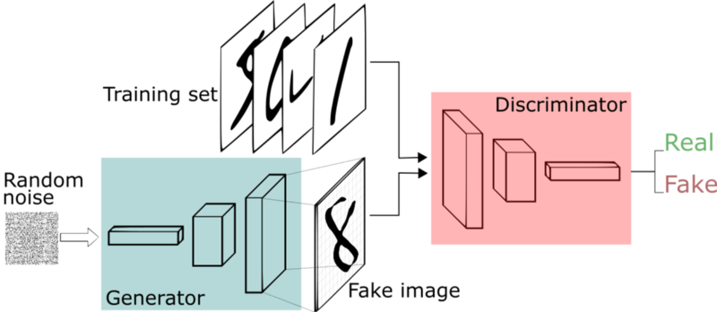
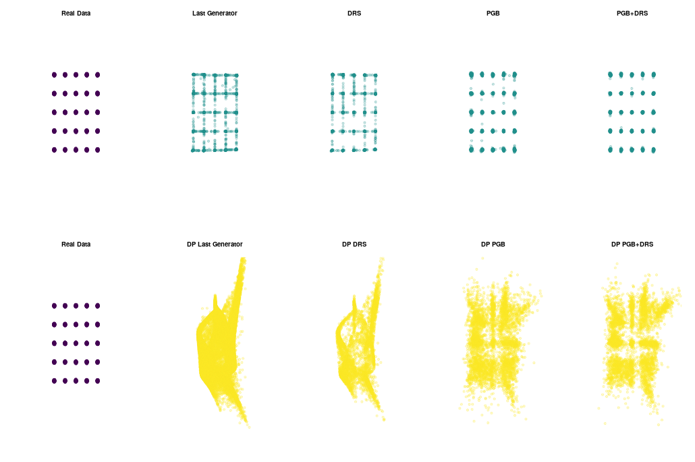
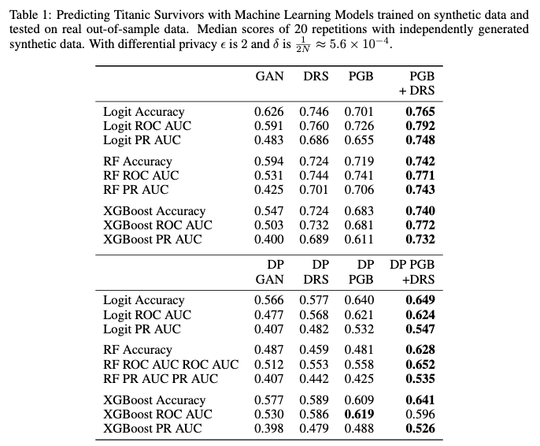

```{r setup, include=FALSE}
options(htmltools.dir.version = FALSE)
knitr::opts_chunk$set(
  fig.width=9, fig.height=3.5, fig.retina=3,
  out.width = "100%",
  cache = FALSE,
  echo = TRUE,
  message = FALSE, 
  warning = FALSE,
  hiline = TRUE
)
library(xaringanthemer)

library(showtext)
## Loading Google fonts (https://fonts.google.com/)
font_add_google("Lato", "lato")
font_add_google("Lora", "lora")

## Automatically use showtext to render text
showtext_auto()

```

```{r xaringan-themer, include=FALSE, warning=FALSE}
color_vec <- c("#1c5253")
style_mono_accent(
  base_color = color_vec[1],
  header_font_google = google_font("Lato"),
  text_font_google   = google_font("Lora"),
  code_font_google   = google_font("Fira Mono")
)
```

```{r, load_refs, include=FALSE, cache=FALSE}
library(RefManageR)
BibOptions(check.entries = FALSE,
           bib.style = "authoryear",
           cite.style = "alphabetic",
           style = "markdown",
           hyperlink = FALSE,
           dashed = FALSE)
myBib <- ReadBib("./myBib.bib", check = FALSE)
```

<style type="text/css">
.remark-slide-content {
    font-size: 30px;
}

.table {
  font-size: 8px;
}


</style>

## The Course Materials

You can find the presentation at:

[http://marcel-neunhoeffer.com/ds3_gan/00_ds3_gan_presentation.html#1](http://marcel-neunhoeffer.com/ds3_gan/00_ds3_gan_presentation.html#1)

The colab workbooks can be found here:

[https://github.com/mneunhoe/ds3_ml](https://github.com/mneunhoe/ds3_gan)

---
class: inverse center middle

## About Me

???
Marcel, researcher at the chair of Data science and statistics for the social sciences and humanities at the LMU Munich

In my work I use Generative Adversarial Networks, a type of deep learning for social scientists.
E.g. ml to predict elections, multiple imputation, the generation of privacy protective synthetic data, understanding and explaining ML methods to social scientists

---

## Why are you interested in Generative Adversarial Nets?

.center[
```{r echo = F, fig.retina=3, out.width = 500}

```
]

---

## Why are you interested in Generative Adversarial Nets?

<div style='position: relative; padding-bottom: 56.25%; padding-top: 35px; height: 0; overflow: hidden;'><iframe sandbox='allow-scripts allow-same-origin allow-presentation' allowfullscreen='true' allowtransparency='true' frameborder='0' height='315' src='https://www.mentimeter.com/embed/03561f4c35dc802b68babe85b8683a2c/f8b872791827' style='position: absolute; top: 10; left: 0; width: 100%; height: 80%;' width='420'></iframe></div>


???
Before we get started I want to know a bit more about you. Why are you interested in Generative Adversarial Nets? No wrong answers
Summarize results...

---

## [This cat does not exist](https://thiscatdoesnotexist.com)


<iframe sandbox='allow-scripts allow-same-origin allow-presentation' allowfullscreen='true' allowtransparency='true' frameborder='0' height='315' src='https://thiscatdoesnotexist.com' style='position: absolute; top: 10; left: 50%; margin-left: -210px; width: 100%; height: 80%;' width='420'></iframe>


---

## [This person does not exist](https://thispersondoesnotexist.com)


<iframe sandbox='allow-scripts allow-same-origin allow-presentation' allowfullscreen='true' allowtransparency='true' frameborder='0' height='315' src='https://thispersondoesnotexist.com' style='position: absolute; top: 10; left: 0; width: 100%; height: 80%;' width='420'></iframe>


---

## These voices never said those words


.center[
```{r echo = F, fig.retina=3, out.width = 700}

```
]

---

class: inverse center middle

## Why we should care

---

## Fake persons are used to spread misinformation

.center[
```{r echo = F, fig.retina=3, out.width = 250}
knitr::include_graphics("martin-aspen.jpg")
```
]
A viral dossier about Hunter Biden was written by "Martin Aspen," a fake identity whose profile picture was created by artificial intelligence. [NBC News, Oct. 29, 2020](https://www.nbcnews.com/tech/security/how-fake-persona-laid-groundwork-hunter-biden-conspiracy-deluge-n1245387)

---

## Deep fakes make it harder to trust audio visual sources

.center[
```{r echo = F, fig.retina=3, out.width = 450}

```
]
[A deep fake from five years ago.](https://www.youtube.com/watch?v=YfU_sWHT8mo)

---

## But: Generative Adversarial Nets can also be a useful method for Data Science

Some examples: 
- Imputation of missing values

- Privacy protective synthetic data

- Generating visual vignettes for survey experiments

---

## Today we will learn...

- GAN basics

- how to code a simple GAN from scratch

- about different GAN design choices 

- how to generate fake images

---

class: inverse center middle

## GAN basics

https://www.freecodecamp.org/news/an-intuitive-introduction-to-generative-adversarial-networks-gans-7a2264a81394
---

## Generative Adversarial Nets are surprisingly simple

- Generative Adversarial Nets (GANs), introduced by [Goodfellow et al. (2014)](https://proceedings.neurips.cc/paper/2014/file/5ca3e9b122f61f8f06494c97b1afccf3-Paper.pdf), allow it to sample from arbitrary joint (continuous) distributions.
- At its core, a GAN is a minimax game with two competing actor: a generator (G) to produce realistic fake samples from random noise and a discriminator (D) trying to distinguish real from fake samples.
- Formally, this two-player minimax game can be written as:
\begin{align}
\min_G \max_D \;  {\mathbb{E}}_{x\sim p_X}[\log(D(x))] + {\mathbb{E}}_{z\sim p_z}[\log(1 - D(G(z)))]
\end{align}

$p_{X}$ is the distribution of the real data, $x$ is a sample from $p_{X}$.
The generator network $G(z)$ takes as input $z$ from $p_z$, where $z$ is a random sample from a probability distribution $p_z$.

---

## Generative Adversarial Nets are surprisingly simple

.center[
```{r echo = F, fig.retina=3, out.width = 750}

```
]


[Source: freecodecamp.org, Thalles Silva](https://medium.freecodecamp.org/an-intuitive-introduction-to-generative-adversarial-networks-gans-7a2264a81394)

---

class: inverse center middle

## Exercise 1: Coding a simple GAN from scratch

---

class: inverse center middle

## GAN design choices

---

## Different GAN value functions

 - An important design decision is the choice of the value function.
 
 - While the original GAN value function has an intuitive formulation, it turned out that if the discriminator is very good at distinguishing between real and fake data it is very hard to learn (i.e. update the weights in the networks) due to vanishing gradients.
 
 - [Arjovsky, Chintala and Bottou (2017)](https://proceedings.mlr.press/v70/arjovsky17a.html) proposed an alternative value function based on the Wasserstein distance. 
 
 - Using the Wasserstein distance instead of the JS divergence has some desirable properties (in particular no vanishing gradients).
 
---

## Different GAN value functions

This leads to the following value function:

\begin{align}
\min_G \max_D \;  {\mathbb{E}}_{x\sim p_X}[(D(x))] - {\mathbb{E}}_{z\sim p_z}[D(G(z))]
\end{align}

- For the Wasserstein value function the discriminator needs to be a Lipschitz continuous function with a Lipschitz constant $\leq 1$. In practice this is achieved by clipping the weights of the discriminator to a pre-specified range e.g. $[-0.01, 0.01]$.

- More recent work by [Song and Ermon (2020)](https://proceedings.mlr.press/v119/song20a.html) introduces additional novel value functions.

---

## Choosing network architectures

- Parts of the network architecture (especially the output layer of the discriminator) depend on the chosen value function.

- It is important that the discriminator has enough capacity. Where the meaning of enough capacity is dependent on the application. 

  - For image synthetization convolutional neural network architectures achieve the best results.
  - For time series recurrent neural network architectures are sensible choices. 
  - For tabular data simpler fully connected network architectures are usually sufficient (with the exception of data of mixed types). 

---

## Choosing the noise distribution

- In most GAN applications the noise distribution for the generator $p_z$ is a standard normal distribution.
- For images sometimes an uniform distribution on the interval $(-1,1)$ is used.

- However, [Huster et al. (2021)](https://proceedings.mlr.press/v139/huster21a.html) show that the choice of the noise distribution influences the behavior of GAN training. 

- [Liang et al. (2022)](https://proceedings.mlr.press/v162/liang22b.html) show that the generation of high quality images can be improved by leveraging *hubness* of the noise distribution.

---

## Choosing optimization algorithms

- The optimization of GANs is notoriously hard. 

- Recent research shows see e.g. [Heusel et al. (2017)](https://proceedings.neurips.cc/paper/2017/file/8a1d694707eb0fefe65871369074926d-Paper.pdf) or  [Schäfer and Anandkumar (2019)](https://proceedings.neurips.cc/paper/2019/file/56c51a39a7c77d8084838cc920585bd0-Paper.pdf) that gradient ascent descent, i.e. iteratively training the generator and discriminator with the same optimizer, might not be the best option. 

- In particular, [Heusel et al. (2017)](https://proceedings.neurips.cc/paper/2017/file/8a1d694707eb0fefe65871369074926d-Paper.pdf) have shown that using two different learning rates for the optimization of the discriminator and generator improves GAN trainig (two time-scale update rule).

- In addition to the learning rate, the concrete choice of an optimizer as well as other hyperparameters (e.g. momentum, batch size) can also influence GAN training
---

## Choosing dropout during training and generation

- In neural network architectures so-called dropout layers [Srivastava et al. (2014)](https://jmlr.org/papers/v15/srivastava14a.html) can be used to regularize network training and prevent overfitting. 

- A helpful side effect of such dropout layers in classical neural networks is that dropout can also be used to estimate the model uncertainty of neural networks [Gal and Ghahramani (2016)](https://proceedings.mlr.press/v48/gal16.pdf).

- [Anecdotal evidence](https://github.com/soumith/ganhacks) shows that dropout layers might also sstabilize GAN training. 

---

## Choosing dropout during training and generation

- Furthermore, [Isola et al. (2017)](https://ieeexplore.ieee.org/document/8100115) argue that dropout in the generator during data generation provides stochasticity for the synthetic data that promotes diversity of the generated data. 

- A systematic evaluation of the effect of dropout in GANs on the produced synthetic data, especially on the statistical utility of tabular synthetic data, is still missing and warrants more research. 

---

class: inverse center middle

## Exercise 2: Experimenting with dropout

---

class: inverse center middle

## Exercise 3: Generating fake images

---

class: inverse center middle

## Advanced topics

---

## [Private Post-GAN Boosting](https://openreview.net/forum?id=6isfR3JCbi)

- Private GAN training (DP-GAN) performs the same alternating optimization as the basic GAN training, but it optimizes the discriminator under *differential privacy* while keeping the generator optimization the same.

- The private optimization step on the discriminators is done by running the private SGD method [Abadi et al. (2016)](https://dl.acm.org/doi/10.1145/2976749.2978318) or its variants, all which update the parameters with noisy privatized gradients obtained using Gaussian perturbation.

- The entire sequence of discriminators maintained by the private training algorithm satisfies differential privacy, and thus the sequence of generators are also private since they can viewed as computed by post-processing the sequence of discriminators. 

---

## Private Post-GAN Boosting

- When the GAN training fails to converge, the last generator in the last training epoch usually does not provide good synthetic data.

- However, failure to convergence does not preclude the possibility that a mixture of several generators from previous epochs might still generate high quality synthetic data. 

- We describe an amplification method that takes both collections of generators and discriminators and produces a more accurate generative model. 

---

## Private Post-GAN Boosting

**Input**: Generators  $\mathcal{G} = \{G_1, \ldots, G_N\}$ and discriminators $\mathcal{D} = \{D_1, \ldots , D_N\}$ over epochs.
    
   Approximate each generator $G_j$ by taking $r$ samples each; let $B$ be the entire set of the $rN$ examples
   
---

## Private Post-GAN Boosting   
   
**Two-Player Post-GAN zero-sum game**

    
**synthetic data player** maintains a distribution $\phi$ over the data in $B$ to imitate the distribution $P_X$ given by the private data set

**distinguisher player** uses a mixture of discriminators to distinguish distributions $\phi$ and $P_X$
    
**payoff**: for any $x \in B$ and any discriminator $D_j$, 
\begin{align}
U(\phi, D_j) = {\mathbb{E}}_{x'\sim P_X}\left[ D_j(x') \right] + {\mathbb{E}}_{x\sim \phi}\left[(1 -  D_j(x))\right]
\end{align}

the **synthetic data player** tries to minimize $U$ and the distinguisher player tries to maximize $U$.

---

## Private Post-GAN Boosting   

.center[
```{r echo = F, fig.retina=3, out.width = 750}

```
]

---

## Private Post-GAN Boosting   

.center[
```{r echo = F, fig.retina=3, out.width = 600}

```
]

---

class: center, middle

# Thanks!

Slides created via the R packages:

[**xaringan**](https://github.com/yihui/xaringan)<br>
[gadenbuie/xaringanthemer](https://github.com/gadenbuie/xaringanthemer)

The chakra comes from [remark.js](https://remarkjs.com), [**knitr**](http://yihui.name/knitr), and [R Markdown](https://rmarkdown.rstudio.com).
