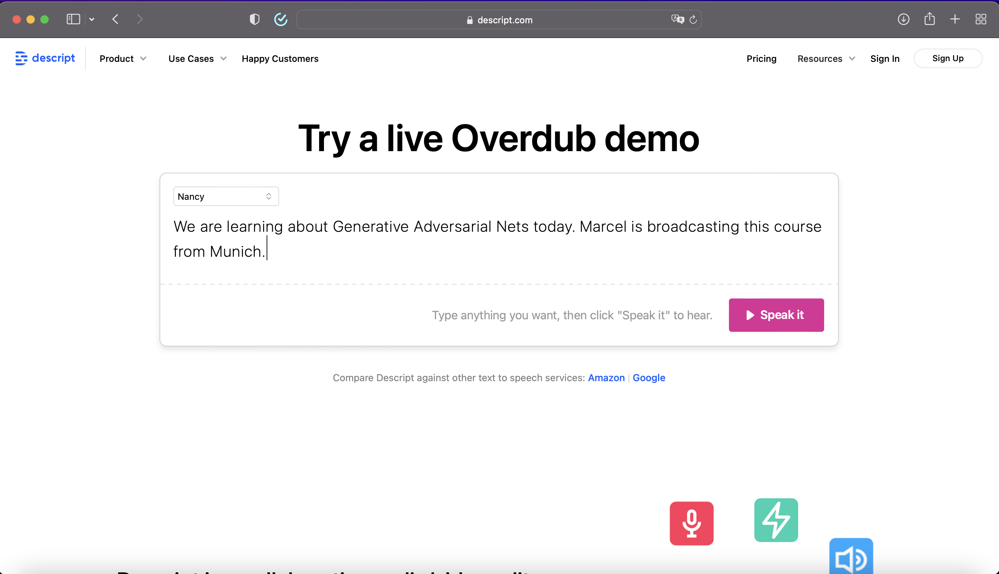

```{r setup, include=FALSE}
options(htmltools.dir.version = FALSE)
knitr::opts_chunk$set(
  fig.width=9, fig.height=3.5, fig.retina=3,
  out.width = "100%",
  cache = FALSE,
  echo = TRUE,
  message = FALSE, 
  warning = FALSE,
  hiline = TRUE
)
library(xaringanthemer)

library(showtext)
## Loading Google fonts (https://fonts.google.com/)
font_add_google("Lato", "lato")
font_add_google("Lora", "lora")

## Automatically use showtext to render text
showtext_auto()

```

```{r xaringan-themer, include=FALSE, warning=FALSE}
color_vec <- c("#1c5253")
style_mono_accent(
  base_color = color_vec[1],
  header_font_google = google_font("Lato"),
  text_font_google   = google_font("Lora"),
  code_font_google   = google_font("Fira Mono")
)
```

```{r, load_refs, include=FALSE, cache=FALSE}
library(RefManageR)
BibOptions(check.entries = FALSE,
           bib.style = "authoryear",
           cite.style = "alphabetic",
           style = "markdown",
           hyperlink = FALSE,
           dashed = FALSE)
myBib <- ReadBib("./myBib.bib", check = FALSE)
```

<style type="text/css">
.remark-slide-content {
    font-size: 30px;
}

.table {
  font-size: 8px;
}


</style>

## The Course Materials

You can find the presentation at:

[http://marcel-neunhoeffer.com/ds3_ml/00_ds3_ml_presentation.html#1](http://marcel-neunhoeffer.com/ds3_ml/00_ds3_ml_presentation.html#1)

The colab workbooks can be found here:

[https://github.com/mneunhoe/ds3_ml](https://github.com/mneunhoe/ds3_ml)

---
class: inverse center middle

## About Me

???
Marcel, researcher at the chair of Data science and statistics for the social sciences and humanities at the LMU Munich

In my work I use Generative Adversarial Networks, a type of deep learning for social scientists.
E.g. ml to predict elections, multiple imputation, the generation of privacy protective synthetic data, understanding and explaining ML methods to social scientists

---

## Why are you interested in Generative Adversarial Nets?

<div style='position: relative; padding-bottom: 56.25%; padding-top: 35px; height: 0; overflow: hidden;'><iframe sandbox='allow-scripts allow-same-origin allow-presentation' allowfullscreen='true' allowtransparency='true' frameborder='0' height='315' src='https://www.mentimeter.com/embed/03561f4c35dc802b68babe85b8683a2c/f8b872791827' style='position: absolute; top: 10; left: 0; width: 100%; height: 80%;' width='420'></iframe></div>


???
Before we get started I want to know a bit more about you. Why are you interested in Generative Adversarial Nets? No wrong answers (or only wrong answers?) 
Summarize results...

---

## [This cat does not exist](https://thiscatdoesnotexist.com)


<iframe sandbox='allow-scripts allow-same-origin allow-presentation' allowfullscreen='true' allowtransparency='true' frameborder='0' height='315' src='https://thiscatdoesnotexist.com' style='position: absolute; top: 10; left: 50%; margin-left: -210px; width: 100%; height: 80%;' width='420'></iframe>


---

## [This person does not exist](https://thispersondoesnotexist.com)


<iframe sandbox='allow-scripts allow-same-origin allow-presentation' allowfullscreen='true' allowtransparency='true' frameborder='0' height='315' src='https://thispersondoesnotexist.com' style='position: absolute; top: 10; left: 0; width: 100%; height: 80%;' width='420'></iframe>


---

## These voices never said those words


.center[
```{r echo = F, fig.retina=3, out.width = 700}

```
]

---

class: inverse center middle

## Why we should care

---

## Fake persons are used to spread misinformation

.center[
```{r echo = F, fig.retina=3, out.width = 250}
knitr::include_graphics("martin-aspen.jpg")
```
]
A viral dossier about Hunter Biden was written by "Martin Aspen," a fake identity whose profile picture was created by artificial intelligence. [NBC News, Oct. 29, 2020](https://www.nbcnews.com/tech/security/how-fake-persona-laid-groundwork-hunter-biden-conspiracy-deluge-n1245387)

---

## Deep fakes make it harder to trust audio visual sources

.center[
```{r echo = F, fig.retina=3, out.width = 450}
knitr::include_graphics("obama.png")
```
]
[A deep fake from five years ago.](https://www.youtube.com/watch?v=YfU_sWHT8mo)

---

## But: Generative Adversarial Nets can also be a useful method for Data Science

Some examples: 
- Imputation of missing values
- Privacy protective synthetic data
- Generating visual vignettes for survey experiments

---

## Today we will learn...

- GAN basics
- how to code a simple GAN from scratch
- about different GAN design choices 
- how to generate fake images

---

class: inverse center middle

## GAN basics

---

class: inverse center middle

## Coding a simple GAN from scratch

---

class: inverse center middle

## GAN design choices

---

class: inverse center middle

## Generating fake images

---

## References

```{r refs, echo=FALSE, results="asis"}
NoCite(myBib, 1:3)
PrintBibliography(myBib)

```

---
class: center, middle

# Thanks!

Slides created via the R packages:

[**xaringan**](https://github.com/yihui/xaringan)<br>
[gadenbuie/xaringanthemer](https://github.com/gadenbuie/xaringanthemer)

The chakra comes from [remark.js](https://remarkjs.com), [**knitr**](http://yihui.name/knitr), and [R Markdown](https://rmarkdown.rstudio.com).
